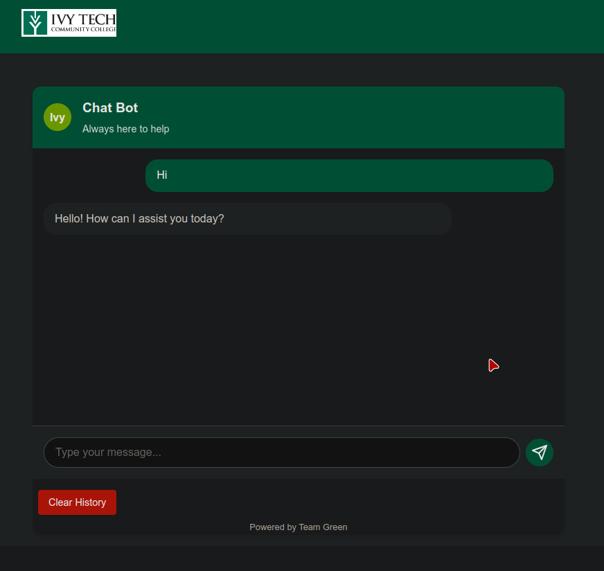

# IVY Tech Chat Bot



## Table of Contents

[Install Instructions](#installation)

[How to use](#how-to-use)

## Installation

**NOTE:** This program is met to run on a server.

### Requirements

- git

- python3.12.7 \>=

### Download

```bash
git clone https://github.com/HackerTheFox/SDEV265-ChatBot.git
cd SDEV265-ChatBot
```

### Setup Virtual Environment

```bash
# Setup venv
python -m venv .venv
source .venv/bin/activate # WINDOWS USERS: Might have to run another binary than activate. Just look in this dir for the correct binary.

# Download Dependencies
pip install -r requirements.txt
```

## How to use

- **NOTE:** Don't forget to activate the virtual environment.

### 1. Add api key from OpenAI

1. Go to this website create an account and generate an api key.
   [OpenAI Platform](https://platform.openai.com/docs/api-reference/introduction)

2. Copy and paste api key in this file. if file `api_key.txt` does not exist then create it.
   
   ```textfile
   SDEV265-ChatBot
   │    course_pds
   │    .git
   │    storage_directory
   │    templates
   │    .venv
   │    api_key.txt (THIS FILE!!!)
   │    main.py
   │    pdf_vectorizer.py
   │    README.md
   │    requirements.txt
   └───
   ```

### 2. Generate Vector Files from .pdf's

```bash
python pdf_vectorizer.py
```

### 3. Run Server

```python
python main.py
```

### 4. Access Program in Web Browser

Click this link to go to it.

[localhost:5000](http://127.0.0.1:5000)
